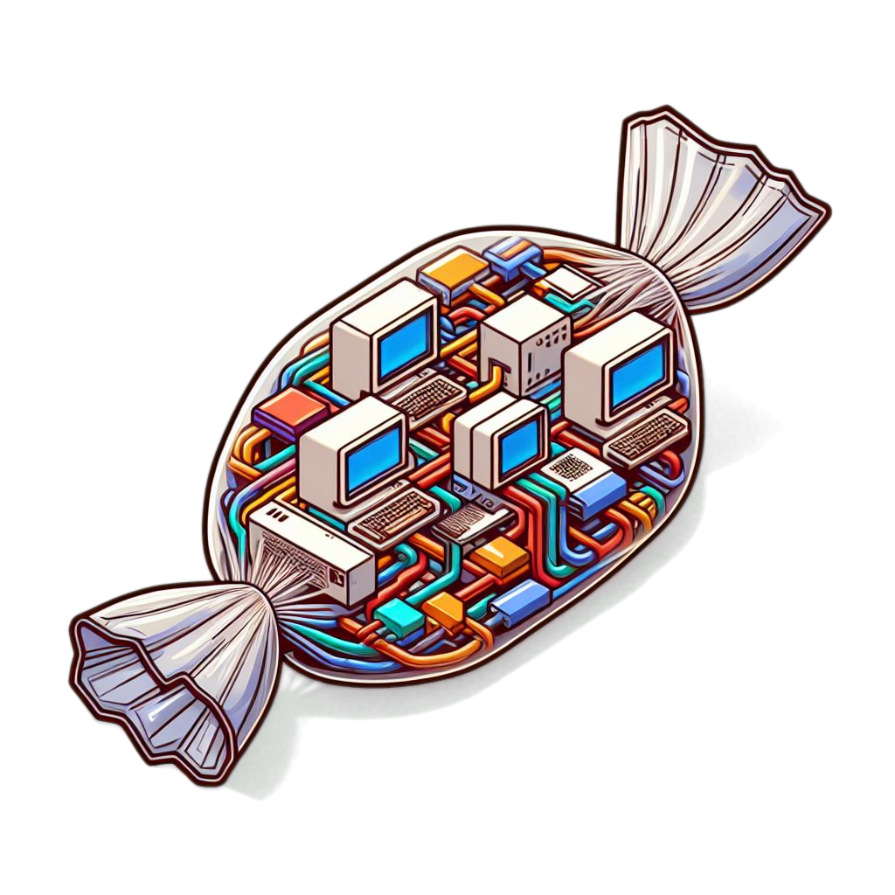

<!-- markdownlint-disable MD033 Used for centered logo -->
<!-- markdownlint-disable MD013 Allow long lines -->
<!-- markdownlint-disable MD036 Used for disclaimer -->

# Cellophane

  

---

Cellophane is a library for creating modular wrappers. The purpose is both to facilitate wrapping a pipeline with a common framework, and also to simplify the process of porting the wrapper to a different HPC environment, LIMS, long term storage, etc.

**❗️ HERE BE DRAGONS ❗️**

Cellophane is not battle tested and may break, blow up, and/or eat your pet(s), etc.

## Usage

See [USAGE.md](USAGE.md) for a detailed explanation of how to use cellophane.

## To-do

- Ensure common exceptions are handled
- Implement missing JSON Schema features (e.g. pattern, format, etc.) if possible
- Add functionality for generating `hydra-genetics` units.tsv/samples.tsv
